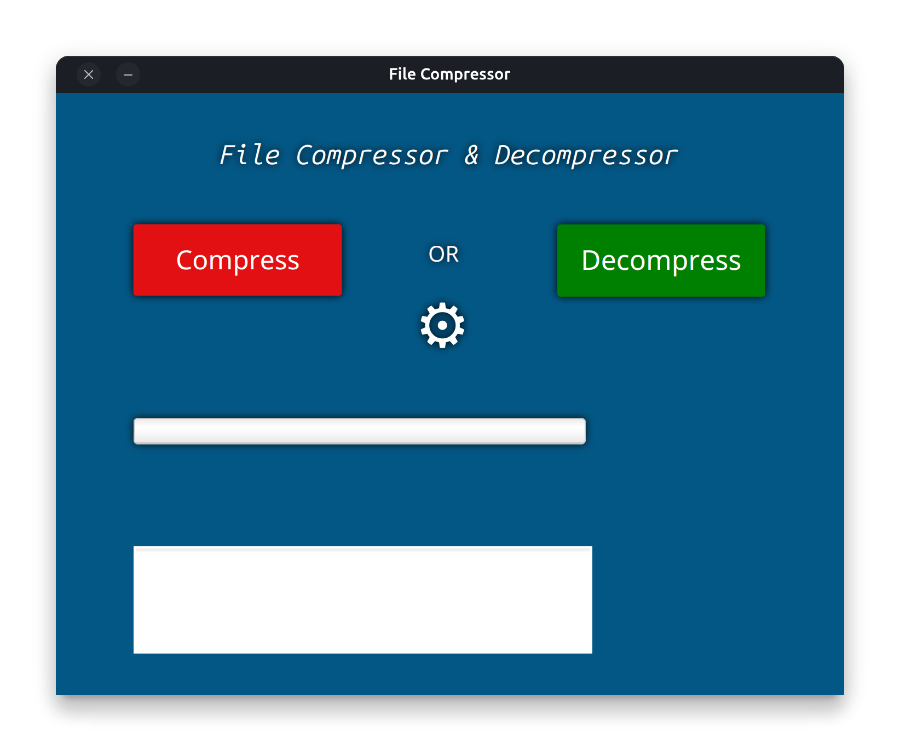

# File Compressor & Decompressor (JavaFX)

A simple JavaFX application to **compress multiple files into a ZIP** and **decompress ZIP files**.  
The application provides a **progress bar** and **log area** to display the current file being processed and the final statistics.

---

## Features

- Select multiple files to compress into a single ZIP.
- Choose a save location for the ZIP file.
- Decompress ZIP files to a selected directory.
- Displays compression and decompression progress with a progress bar.
- Logs file operations and size statistics in a TextArea.

---

## Tools Used

- **IntelliJ IDEA** – Java IDE for development
- **Maven** – Project build and dependency management
- **Scene Builder** – For designing JavaFX FXML UI layouts  

---

## Screenshots

